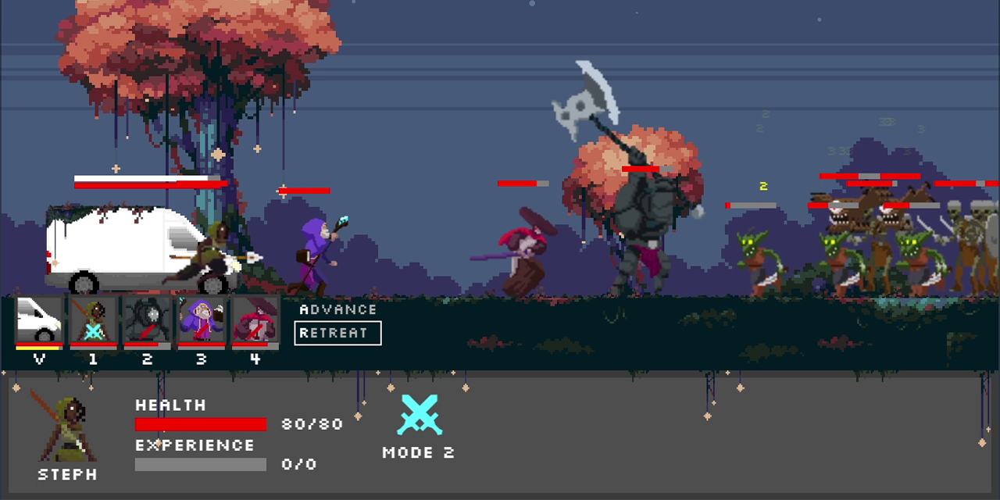

# VanGuardians

https://vanguardians-lfa.netlify.app/

A full-stack web project that contains a 2D party-management, survival game built on HTML canvas.
The website is built with React, and fetches/writes data using a Flask backend.
The game features extensive object-oriented programming, with up to 10 unique character objects, each having their own sets of behaviors and interactions with each other.

## How to Play

Command up to 6 Guardians to protect the Time-Travelling Van! 
Guardians fight enemies automatically but each Guardian offers 2 distinct fighting modes that change up their role. Some may be good at dealing damage, others at pushing enemies back. More information can be found on the 'Guardians' page of the website.

Press keys **'1'** to **'6'** to switch the corresponding Guardian's fighting mode. 
Press **'R'** to command Guardians to advance. 
Press **'A'** to command Guardians to retreat. 

